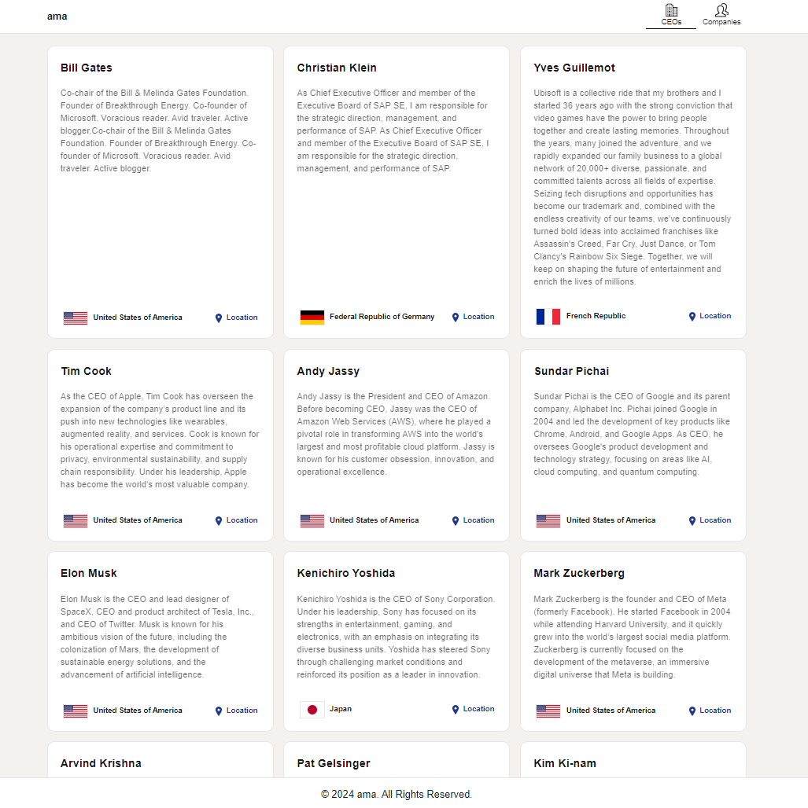
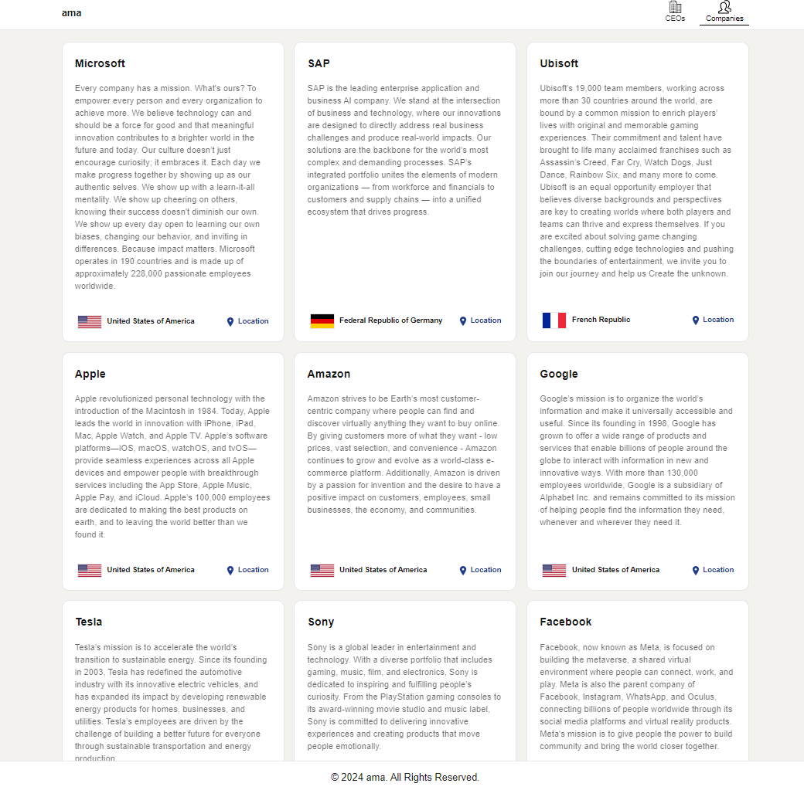

## AMA Challenge

## [Check it live here](https://ama-challenge.netlify.app/)




## Technologies Used

- react: "^18",
- react-dom: "^18",
- next: "14.2.8",
- typescript: "^5",
- tailwindcss: "^3.4.1",
- eslint: "^8",

## Getting Started

These instructions will get you a copy of the project up and running on your local machine for development and testing purposes. See deployment for notes on how to deploy the project on a live system.

### Installing

Clone the Repository and run

```
npm install
npm run dev
```

## Deployment

To deploy simply run

```
npm run build
```

## Project Structure

### app - in this folder are included:

- ceos folder - for ceos page
- companies folder - for companies page
- in the page.tsx I did a redirection to ceos page, because no time to create a Home Page
- is added provider.tsx for DataProvider.

### components - in this folder are included:

- Header Component
- Footer Component
- ImageContainer - a component for flags
- Card - the component that shows details about CEOs or Companies
- icons folder - where are included svg icons used in the application

### context

In this folder is created a component for DataContext, because all the app data are fetched from the local json file data.json, so in this way we do a call to get the data and use them in all the components.
In case we have different backend APIs for CEOs and Companies this solution is not helpfull, we need to do separated call in each page.

### hooks

In this folder I have created the useData hook to get the data from data.json file in the public folder.
And a function to fetch from the API (https://restcountries.com/v3.1/alpha?codes={code},{code},{code}
) the additional data for the list of countries included in the data.json.

### models

In the models folder we have all the data types used in the app.

## Improvements

- We can add a search input, to search for companies or CEOs.
- We can add paginations, in this case are not a lot of data, but is a good choice usually when we get a list of data from an API.
- Lazy loading also will be good if we get a lot of data from an API, but in this case we don't have performance issues because are a limited list of data.
- To add a spinner on data load.
- To add a NotFound page if the user type a wrong url.
- To show any message if any error happens during data fetch.
- The UI is not exactly like LinkedIn, because no time to include the fonts, to check exactly the spaces ...etc
